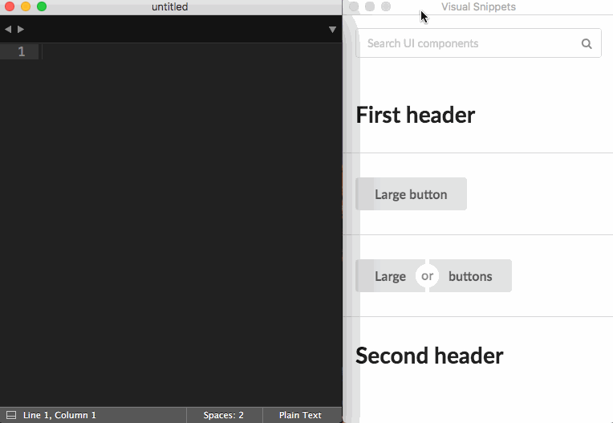

# vsnip

Visual snippet copy-paste tool

[](https://travis-ci.org/dikarel/vsnip.js)

## Quickstart

```bash
npm install # Install dependencies
npm test    # Run tests
npm start   # Run vsnip locally
npm build   # Build/package vsnip
```



## Todo

- [ ] Automated releases
- [ ] Paste snippets directly into code editor
- [ ] Semantic UI snippets
- [ ] Unit tests
- [ ] Acceptance tests
- [ ] Bootstrap snippets
- [ ] Foundation snippets
- [ ] Font Awesome snippets
- [ ] Google Material Icon snippets
- [ ] HTML preprocessor snippets
- [ ] Fuzzy search
- [ ] Entire-page snippets

## Resources

- https://github.com/mawie81/electron-window-state
- https://github.com/electron/spectron
- https://github.com/sindresorhus/electron-config
- https://github.com/jviotti/electron-json-storage
- https://github.com/sindresorhus/electron-context-menu
- https://github.com/louischatriot/nedb